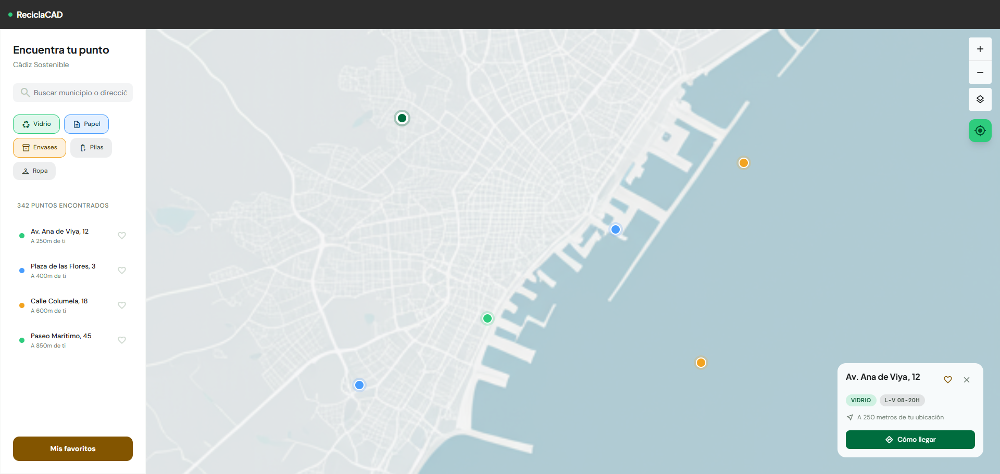
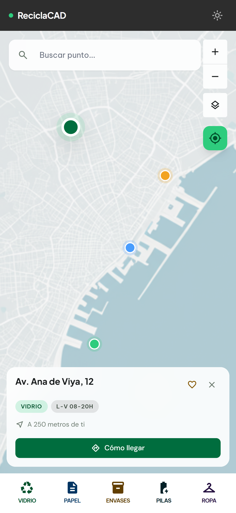
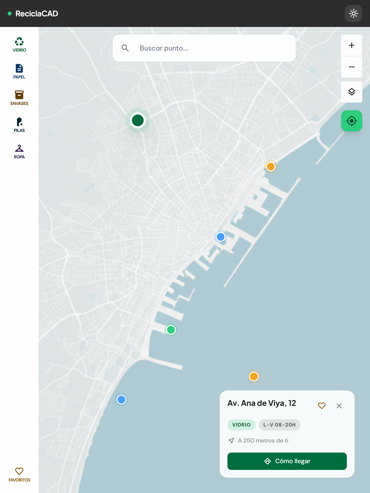
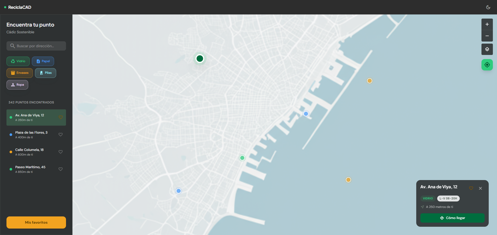
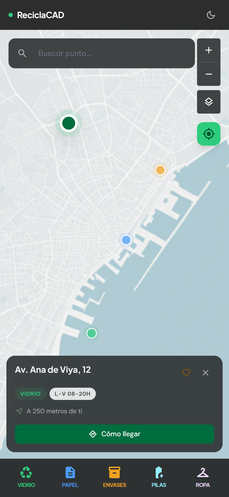
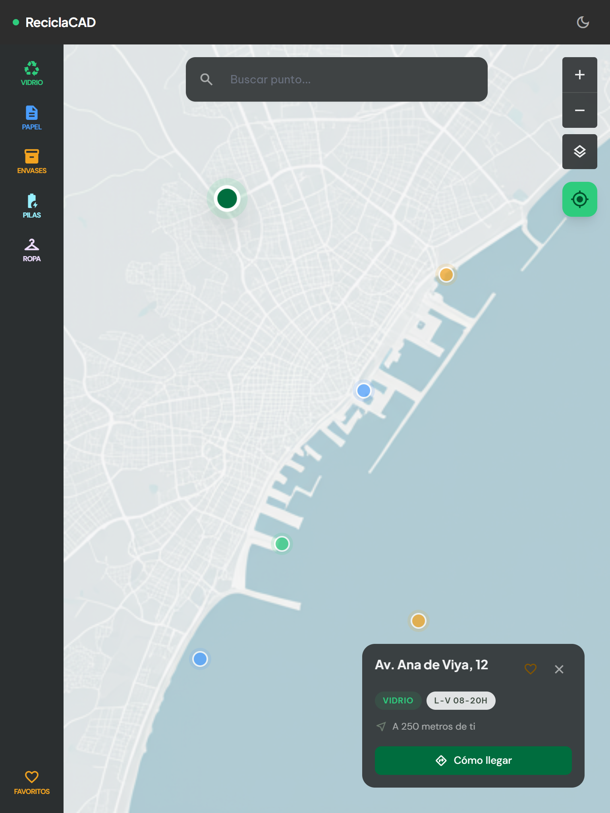

# ReciclaCAD — Design

> UI prototype for ReciclaCAD, a recycling point finder for the city of Cádiz.

[](https://developer.mozilla.org/docs/Web/HTML)
[](https://tailwindcss.com)
[](https://fonts.google.com/icons)
[](LICENSE.md)

ReciclaCAD helps citizens of Cádiz find the nearest recycling point. This repository contains the full visual design as static HTML, built with Tailwind CSS v4, following the "The Urban Cartographer" design system — a blend of architectural precision and the airy character of Andalusia's coastline.

## Preview

### Light mode

#### Desktop



#### Mobile



#### Tablet



### Dark mode

#### Desktop



#### Mobile



#### Tablet



## Screens

| Screen | File | Description |
|--------|------|-------------|
| Main map | [index.html](index.html) | Map view with search, category filters, point details, and nearest points list — **primary reference for the webapp implementation** |
| Favourites | [favorites.html](favorites.html) | User-saved recycling points |

> [!IMPORTANT]
> `index.html` is the main reference file for the webapp to be developed. It contains the canonical layout, the Tailwind configuration (colour tokens, typography scale, border radii), and the full component set that all other screens are derived from.

## Features

- **Two usage contexts** — optimised for quick on-the-street mobile use and relaxed desktop planning
- **Light & dark mode** — full support via Tailwind `dark:` utilities
- **Responsive layout** — fluid from mobile to wide desktop
- **Custom design system** — Material You-inspired colour palette, editorial typography, glassmorphism overlays
- **Accessibility** — targets WCAG AA; semantic `aria-*` attributes and `prefers-reduced-motion` support throughout
- **Zero JS dependencies** — pure static HTML, ideal for developer handoff

## Tech stack

| Technology | Role |
|------------|------|
| HTML5 | Semantic screen structure |
| [Tailwind CSS v4](https://tailwindcss.com) (CDN) | Utility classes and design tokens |
| [Plus Jakarta Sans](https://fonts.google.com/specimen/Plus+Jakarta+Sans) | Display & headline typeface |
| [Be Vietnam Pro](https://fonts.google.com/specimen/Be+Vietnam+Pro) | Body & label typeface |
| [DM Sans](https://fonts.google.com/specimen/DM+Sans) | UI component typeface |
| [Material Symbols Outlined](https://fonts.google.com/icons) | Icon set |
| [Google Stitch](https://stitch.withgoogle.com) | AI-assisted initial design generation |
| [Impeccable](https://github.com/pbakaus/impeccable/) | AI agent skills for design refinement |
| [Visual Studio Code](https://code.visualstudio.com/) | Code editor for iterative design adjustments |
| [GitHub Copilot](https://copilot.github.com/) | AI code suggestions during design refinement |
| [Claude Sonnet 4.6](https://www.anthropic.com/) & [GPT 5.3 Codex](https://openai.com/) | AI models used in VS Code + GitHub Copilot for design iteration and consistency checks |

## Getting started

No build step required. Clone the repo and open any HTML file directly in your browser:

```bash
git clone https://github.com/davidcopano/reciclacad-design.git
cd reciclacad-design
```

Then open `index.html` or `favorites.html` in your browser. All assets load from CDN.

> [!TIP]
> Use the [Live Server](https://marketplace.visualstudio.com/items?itemName=ritwickdey.LiveServer) VS Code extension for instant hot-reload while exploring or editing the design files.

## Design system

The full design specification lives in [DESIGN.md](DESIGN.md). Key principles:

### Design tooling

The workflow combined two AI-assisted tools:

- **[Google Stitch](https://stitch.withgoogle.com)** — used for the initial design generation, turning the brief and colour system into a first-pass set of screens.
- **[Impeccable](https://github.com/pbakaus/impeccable/)** — a collection of AI agent skills for VS Code Copilot, used to iteratively refine spacing, typography, accessibility, and design-system consistency across all screens.

### North Star: "The Urban Cartographer"

Architectural blueprint precision meets the airy lightness of the Andalusian coast. The aesthetic—*Breathable Precision*—favours generous white space, intentional asymmetry, and tonal layering over hard outlines.

### Colour palette

| Role | Base | Container | Metaphor |
|------|------|-----------|----------|
| Primary | `#006D3E` | `#2ECC7D` | Glass |
| Secondary | `#005FAD` | `#499DFE` | Paper |
| Tertiary | `#835500` | `#F2A320` | Packaging |
| Surface | `#F8F9FA` | — | Canvas |

### The No-Line Rule

Solid `1px` borders are prohibited. Depth is achieved through tonal surface shifts (`surface` → `surface-container-low` → `surface-container-lowest`) and glassmorphism for floating elements (`surface-container-lowest` at 85% opacity + `backdrop-blur-xl`).

### Typography

| Usage | Font | Weight | Notes |
|-------|------|--------|-------|
| Headlines | Plus Jakarta Sans | 700–800 | `letter-spacing: -0.02em` |
| Body & labels | Be Vietnam Pro | 400–600 | Neutral, readable |
| UI components | DM Sans | 400–700 | Chips, buttons, nav |

## Project structure

```
reciclacad-design/
├── index.html          # Main view — map, search, and points list
├── favorites.html      # User's saved favourite points
└── DESIGN.md           # Full design system documentation
```

## Resources

- [DESIGN.md](DESIGN.md) — Colour system, typography, components, and design dos & don'ts
- [Tailwind CSS v4 Docs](https://tailwindcss.com) — Documentation for the version used
- [Material You (M3)](https://m3.material.io) — Reference for the colour system and component patterns
- [Material Symbols](https://fonts.google.com/icons) — Icon library reference
